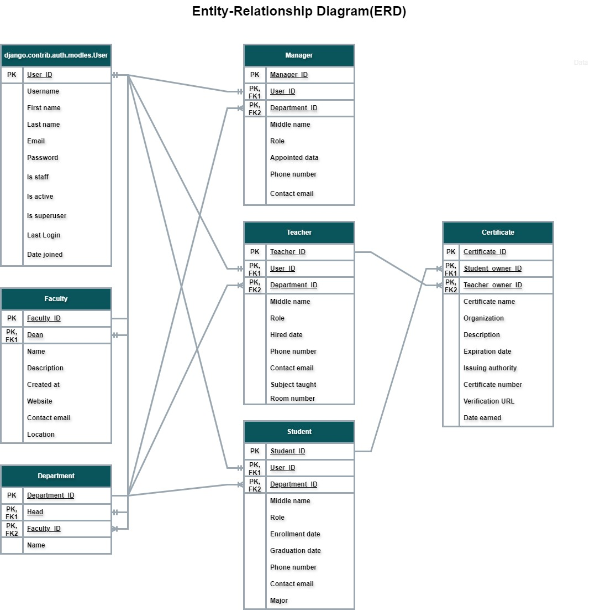
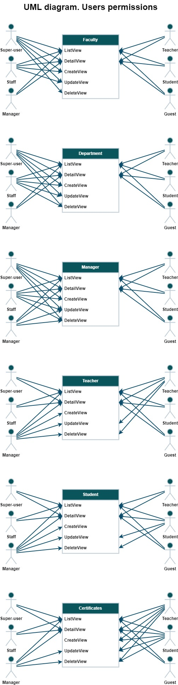
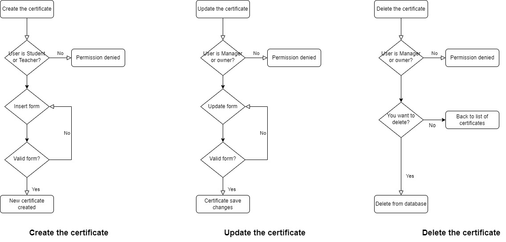

# Qualification Hub

**Qualification Hub** is a Django-based project designed to manage and track educational qualifications, certificates, and related information. It supports various user roles such as teachers, students, managers, and administrators, allowing them to manage certificates and track qualifications.

**_Screen capture_**

<video width="700" height="300" controls>

  <source src="./qualification_hub/static/docs/video/screen-capture.mp4" type="video/mp4">
  Your browser does not support the video tag.
</video>

## Features

- **Certificate Management**: Create, view, update, and delete certificates.
- **User Roles and Permissions**: Different roles with varying access levels (Owner, Admin, Manager, Teacher, Student, Guest).
- **Search Functionality**: Search across multiple models for certificates, users, departments, and more.
- **Authentication and Authorization**: Handles user login, logout, and registration with appropriate permissions.

## User Roles and Permissions

- **Owner**: Superuser with full access to the project.
- **Admin**: Staff member with access to managers, departments, and faculties.
- **Manager**: Access to teachers and students.
- **Teacher**: Access to certificates.
- **Student**: Access to certificates.
- **Guest**: Non-authenticated user with read-only access to public information.

## Visual representation of project

### Entity-Relationship Diagram

Below is the Entity-Relationship Diagram for the project:



### Unified Modeling Language (UML)

Here's a UML class diagram showing the relationships between classes:



### Flowchart

This flowchart describes the process of creating a certificate in the system:



## Setup Instructions

1. **Clone the Repository**

   ```bash
   git clone https://github.com/Kaiyrtay/Thesis-project.git

   ```

2. **Install Dependencies**
   Ensure you have Django and other dependencies installed.

   ```bash
   pip install -r requirements.txt

   ```

3. **Run Migrations**
   Initialize the database and run migrations.

   ```bash
   python manage.py makemigrations
   python manage.py migrate

   ```

4. **Create Groups and Permission**
   Initialize the groups and permissions

   ```bash
   python manage.py create_groups_and_permissions

   ```

5. **Create Superuser**
   Create a superuser account for administrative access.

   ```bash
   python manage.py createsuperuser

   ```

6. **Start the Development Server**
   Launch the Django development server.

   ```bash
   python manage.py runserver

   ```

7. **Access the Application**
   ```bash
   Open a browser and go to `http://127.0.0.1:8000/`.
   ```

## Documentation

- **Project Structure**: Refer to the comments in the codebase for detailed explanations of various components.
- **Mixins**: Custom mixins are used to control permissions and access levels.
- **Models**: The main models are `Certificate`, `Teacher`, `Student`, `Manager`, `Department`, and `Faculty`.

### User Guide

For a detailed user guide, please check the [documentation](./qualification_hub/static/docs/user-guide.md).

### Core

For a detailed core docs, please check the [documentation](./qualification_hub/static/docs/core-docs.md).

### Faculty

For a detailed faculty docs, please check the [documentation](./qualification_hub/static/docs/faculty-docs.md).

### Department

For a detailed department docs, please check the [documentation](./qualification_hub/static/docs/department-docs.md).

### Manager

For a detailed manager docs, please check the [documentation](./qualification_hub/static/docs/manager-docs.md).

### Teacher

For a detailed teacher docs, please check the [documentation](./qualification_hub/static/docs/teacher-docs.md).

### Student

For a detailed student docs, please check the [documentation](./qualification_hub/static/docs/student-docs.md).

### Certificate

For a detailed certificate docs, please check the [documentation](./qualification_hub/static/docs/certificate-docs.md).

## Contributing

Contributions are welcome! Please create a pull request or open an issue if you find bugs or have suggestions for improvements.

## License

This project is licensed under the [MIT License](LICENSE).

Contact
For further questions or support, contact kaiyrtaygabbassov@gmail.com.

Author
Created by Kaiyrtay.

This README.md provides a comprehensive overview of the "Qualification Hub" project, outlining its purpose, key features, setup instructions, and other relevant details. It is designed to help users understand the project's structure, set it up locally, and contribute to its development.
